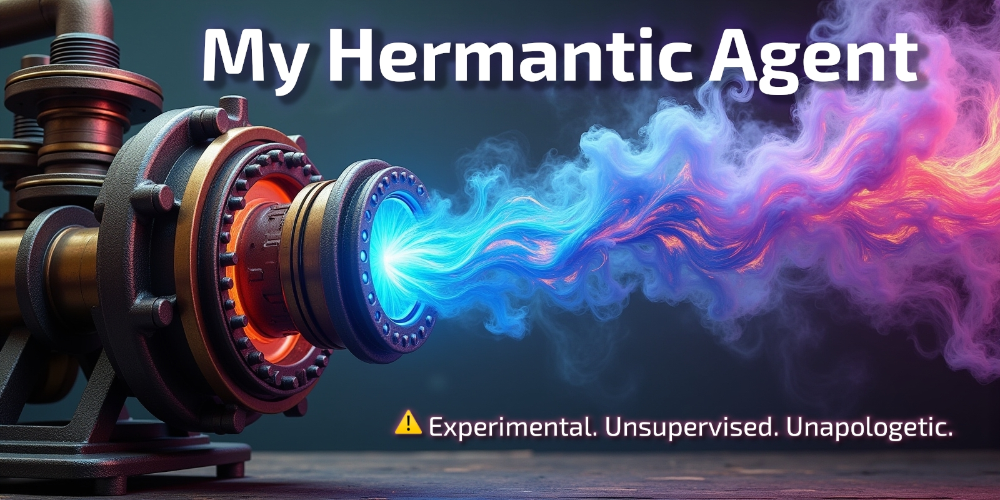
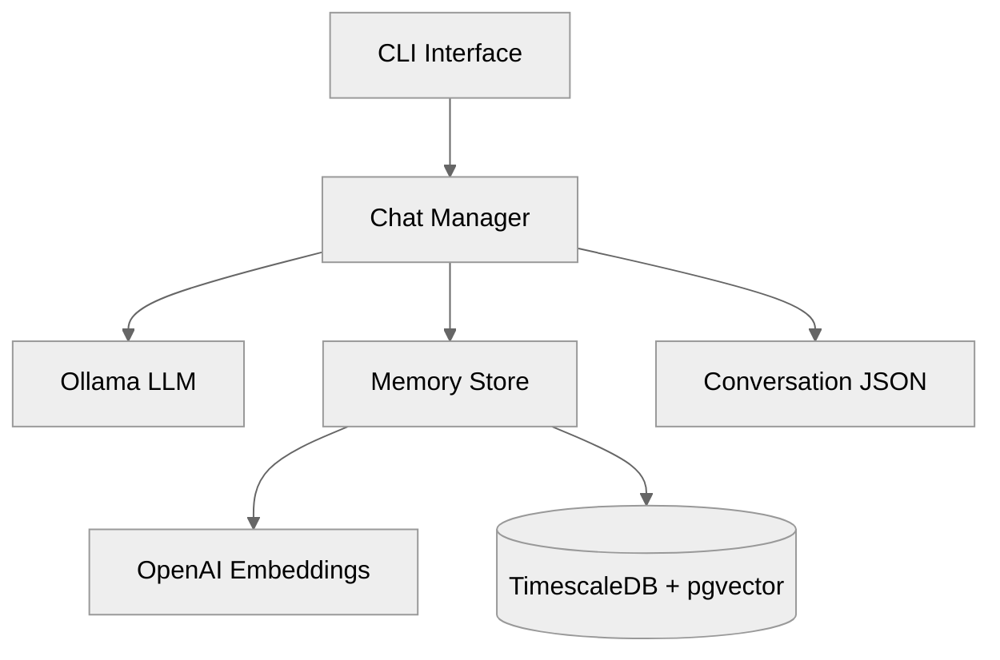

> [!IMPORTANT]
> 🦄 I picked Hermes because he isn’t just another polite autocomplete model. He thinks, he reasons, he grabs tools without asking, and he’ll absolutely fire back when I deserve it. Most models fold when I push; Hermes accelerates. So this repo is my unapologetically chaotic testbed: no roadmap, no safety rails, just an agent let off the leash to see what it does.
>
> Underneath the sparkles and smoke it’s a CLI-driven conversational setup running NousResearch’s Hermes-4-14B locally through Ollama, with persistent semantic memory stitched together from Tiger’s TimescaleDB and OpenAI embeddings. It uses dual memory — short-term context plus long-term recall — manages its own state, and talks the only way I tolerate: direct, sharp, and not here to babysit anyone.
>
> Basically, I handed a capable reasoning model a sandbox, a blowtorch, and too much autonomy. Now I’m watching to see what grows teeth. 🔧✨🔥

______________________________________________________________________

## Quick Start

```bash
# Install dependencies
make install

# Setup environment
make setup
# Edit .env with your OPENAI_API_KEY

# Initialize database (optional, for semantic memory)
make setup-db

# Start chatting
make run
```

**Full setup guide:** [QUICKSTART.md](docs/user-guides/quickstart.md)

______________________________________________________________________

## Features

- 🤖 **Local LLM** - Runs Ollama models locally, no cloud dependency
- 💾 **Dual Memory** - Short-term conversation history + long-term semantic memory
- 🔍 **Semantic Search** - Find relevant memories by meaning, not just keywords
- 🎯 **Smart Context** - Auto-trims conversations to stay within token limits
- 📝 **Persistent** - Conversations auto-save and resume where you left off
- ⚡ **Fast** - Connection pooling, embedding caching, optimized queries
- 🛡️ **Robust** - Comprehensive error handling, atomic file writes, graceful degradation

______________________________________________________________________

## Architecture



**Detailed diagrams:** [docs/ARCHITECTURE.md](docs/system-architecture.md)

______________________________________________________________________

## Documentation

- 📖 **[User Guide](docs/user-guides/project-overview.md)** - How to use the agent effectively
- 🏗️ **[Architecture](docs/system-architecture.md)** - System design and data flow
- 🎛️ **[Model Parameters](docs/model-parameter-options.md)** - Hermes-4 configuration guide
- 🔧 **[Memory API](docs/agent-memory.md)** - Semantic memory reference
- 🚀 **[Quick Start](docs/user-guides/quickstart.md)** - 5-minute setup guide

______________________________________________________________________

## Usage

### Basic Chat

```bash
make run
```

```bash
💬 You: What's the capital of France?
🤖 Assistant: Paris.

💬 You: quit
💾 Memory saved to data/memory.json
Goodbye!
```

### Memory Commands

```bash
# Store a memory
/remember I prefer Python over JavaScript
Type: preference
Context: coding
✓ Memory stored with ID 1

# Search memories
/recall programming preferences
🔍 Found 1 relevant memories:
  [1] PREFERENCE | coding
      I prefer Python over JavaScript
      Similarity: 0.923

# View statistics
/stats
📊 Total memories: 42 | Contexts: 3 | Types: 4
```

**Full command reference:** [docs/USER_GUIDE.md](docs/user-guides/project-overview.md)

______________________________________________________________________

## Requirements

- **Python 3.12+**
- **Hugging Face** - Any model with Ollama support ([huggingface.com](https://huggingface.co/))
- **Ollama** - Local LLM runtime ([ollama.ai](https://ollama.ai))
- **OpenAI API Key** - For embeddings ([platform.openai.com](https://platform.openai.com/api-keys))
- **TimescaleDB** - Optional, for semantic memory ([timescale.cloud](https://console.timescale.cloud))

______________________________________________________________________

## Installation

### 1. Install Dependencies

```bash
make install
```

### 2. Configure Environment

```bash
cp .env.example .env
# Edit .env and add:
# - OPENAI_API_KEY (required)
# - MEMORY_DB_URL (optional, for semantic memory)
```

### 3. Setup Ollama

> [!WARNING]
> **This Is Hermes, Not a Hall Monitor**
>
> Hermes ships without the usual corporate-grade guardrails, seatbelts, bumpers, or soft edges. He’s a hybrid reasoning model with tool access and an attitude, and he will absolutely follow your instructions even when you probably shouldn’t have written them. Before you grab this code and run, go read the docs on what Hermes actually is and what he is not. If you treat him like a safe, shrink-wrapped assistant, that’s on you. This project is an experiment, not a babysitter.

```bash
# Pull the Hermes-4 model
ollama pull hf.co/DevQuasar/NousResearch.Hermes-4-14B-GGUF:Q8_0

# Start Ollama service
ollama serve
```

### 4. Initialize Database (Optional)

```bash
make setup-db
```

______________________________________________________________________

## Project Structure

```plaintext
hermes-agent/
├── config/
│   └── template.yaml      # Model configuration
├── src/agent/
│   ├── chat.py            # Chat interface
│   └── memory.py          # Semantic memory
├── docs/                  # Documentation
├── schema/                # Database schema
├── tests/                 # Unit tests
├── main.py                # Entry point
└── .env                   # Environment variables
```

______________________________________________________________________

## Configuration

### Model Settings

Edit `config/template.yaml` to customize:

```yaml
model: hf.co/DevQuasar/NousResearch.Hermes-4-14B-GGUF:Q8_0
system: |
  You are Hermes, a personal assistant...
parameters:
  temperature: 0.85
  num_ctx: 8192
  # ... more parameters
```

**Parameter guide:** [docs/MODEL_PARAMETERS.md](docs/model-parameter-options.md)

### Environment Variables

```bash
# Required
OPENAI_API_KEY=sk-...

# Optional
MEMORY_DB_URL=postgresql://...
OPENAI_EMBEDDING_MODEL=text-embedding-3-small
OPENAI_EMBEDDING_DIM=1536
```

You can also override which template file the agent loads by setting `TEMPLATE_CONFIG` in your `.env` file. By default the app uses `config/template.yaml`.

```bash
# TEMPLATE_CONFIG=config/template.yaml
```

______________________________________________________________________

## Development

```bash
# Run tests
make test

# View logs
make logs

# Clean artifacts
make clean

# See all commands
make help
```

______________________________________________________________________

## Memory System

### Dual-Memory Architecture

1. **Short-term** - Full conversation history in `data/memory.json`

   - Auto-saves on exit
   - Auto-loads on startup
   - Smart context trimming

1. **Long-term** - Semantic memories in TimescaleDB

   - Vector embeddings for similarity search
   - Organized by type and context
   - Persistent across conversations

### Memory Types

- **preference** - User likes/dislikes
- **fact** - Factual information
- **task** - Todos and action items
- **insight** - Observations and patterns

______________________________________________________________________

## Tech Stack

<div align="center">

  

   

   

</div>

- **Runtime**: Python 3.12+ with [uv package manager](https://docs.astral.sh/uv/)
- **Model**: [NousResearch/Hermes-4-14B](https://huggingface.co/NousResearch/Hermes-4-14B)
- **Ollama**: [ollama.ai](https://ollama.ai)
- **TigerData Agentic Postgres**: [tigerdata.com](https://www.tigerdata.com)
- **Embeddings**: OpenAI API (text-embedding-3-small)
- **Storage**: JSON for conversations, PostgreSQL for semantic memory

______________________________________________________________________

## License

This project is released under the [Polyform Shield License 1.0.0](https://polyformproject.org/licenses/shield/1.0.0/).

In plain language: use it, study it, fork it, remix it, build weird things with it — just don’t make money from it or wrap it into anything commercially sold without getting my permission first. No loopholes, no weird “but technically,” no marketplace shenanigans.

Bottom line? I build free and open software for fun, but with a caveat: if *anybody* is getting paid for it, then I'm first in line! Otherwise, help yourself. 😇

The full legal text lives in the [LICENSE](LICENSE) file if you need the exact wording. 📜🛡️
