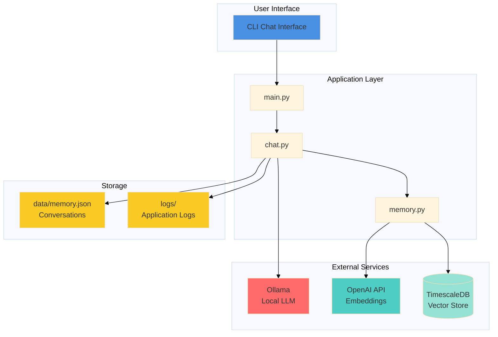
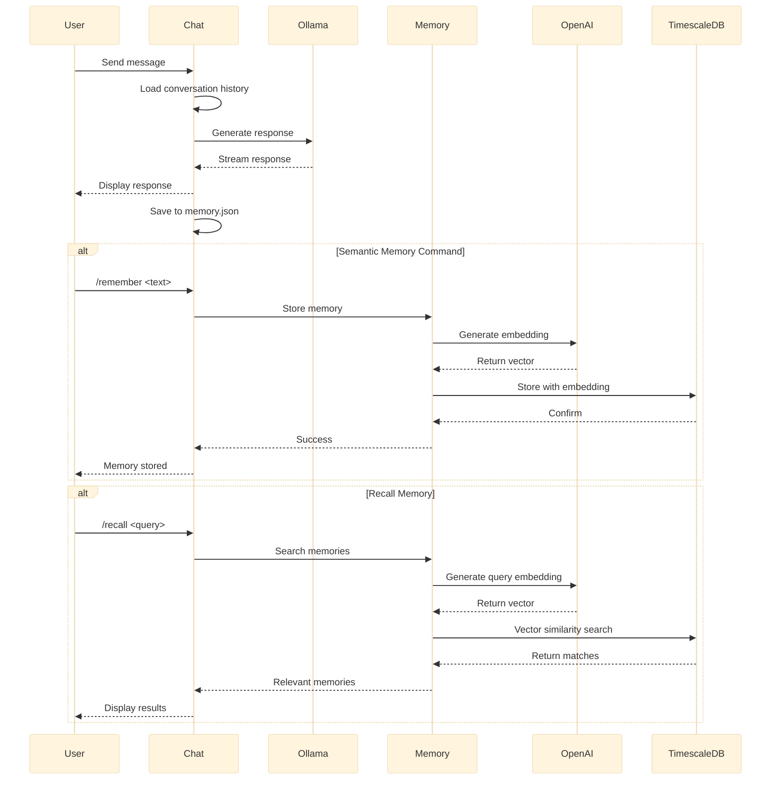
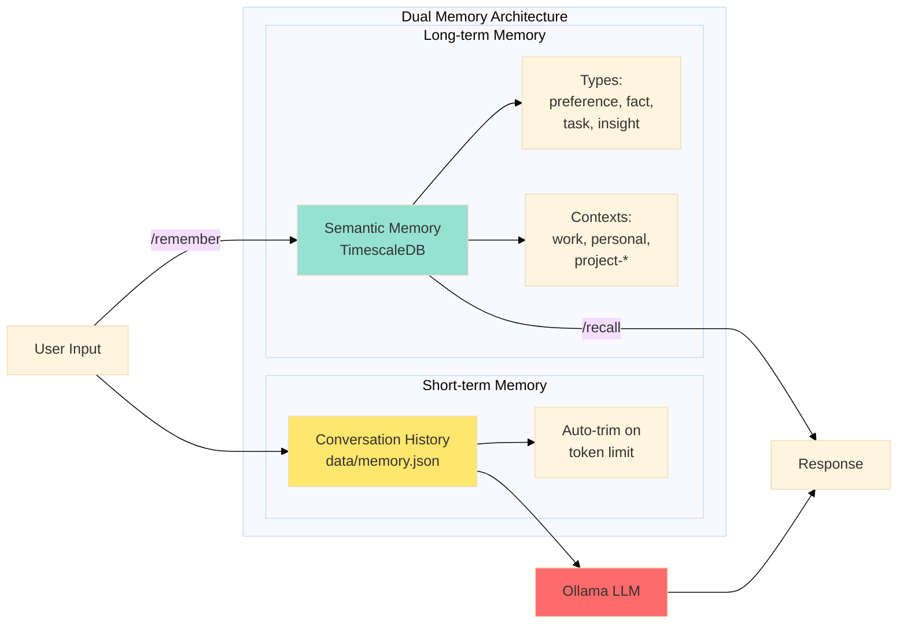
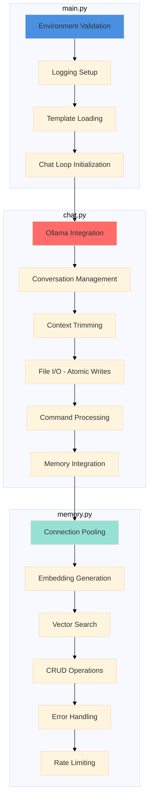
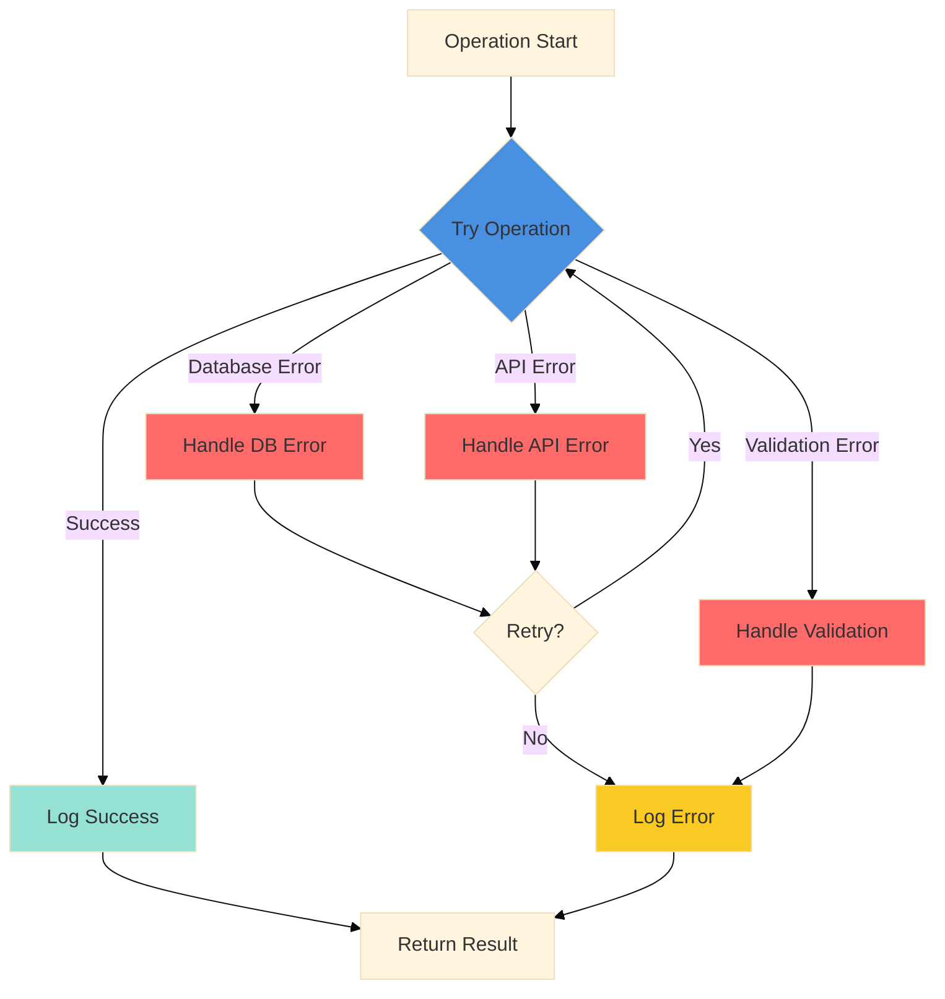
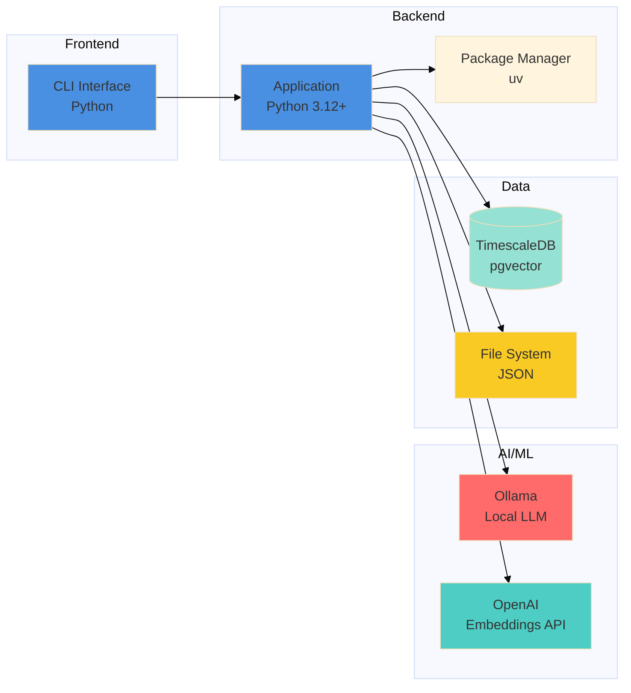

# Architecture Overview

Hermes Agent architecture and data flow diagrams.

## System Architecture

## Data Flow

## Memory System

## Component Responsibilities

## Error Handling Flow

## Technology Stack

