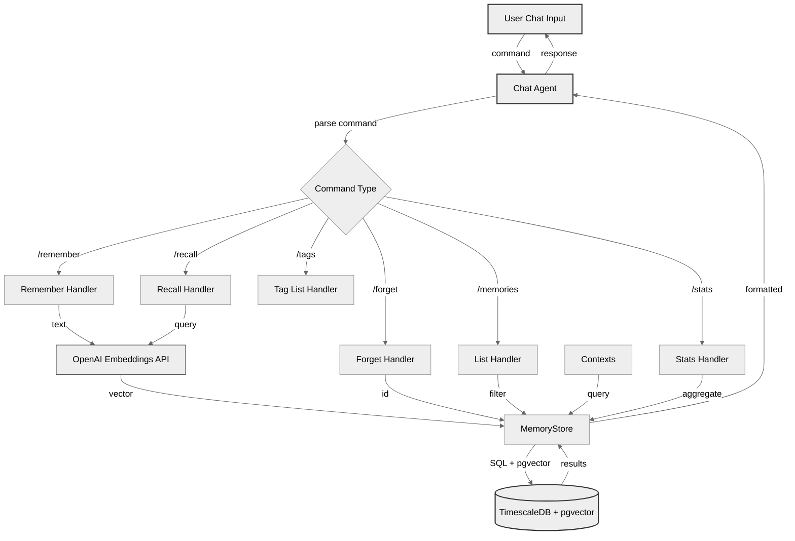

# Memory System Chat Commands

Agent memory system providing semantic storage and retrieval via chat interface.

## Terminology

- **MEMORY** (cloud PostgreSQL): Semantic embeddings in TimescaleDB managed by `/remember`, `/recall`, `/forget`

Memory commands interact exclusively with the cloud database.

## Architecture



## Quick Reference

```bash
# Store memory
/remember type=preference tag=coding User prefers Python

# Search memories
/recall programming preferences

# Delete memory
/forget 42

# List memories by tag
/memories work

# Show all tags
/tags

# View statistics
/stats
```

## Commands

### /remember

Store a new memory in the semantic database.

**Syntax:**

```bash
/remember [type=<type>] [tag=<tag>] [importance=<float>] [confidence=<float>] [source=<src>] <text>
```

**Interactive Mode:**
If `type` or `tag` are omitted, the agent prompts for them.

**Parameters:**

- `type`: Memory type (preference, fact, task, insight)
- `tag`: Tag for organization (e.g., work, personal, project-name)
- `importance`: Importance score 0.0-3.0 (0=low, 1=normal, 2=high, 3=critical; default: 1.0)
- `confidence`: Confidence score 0.0-1.0 (default: 1.0)
- `source`: Source snippet (optional)
- `text`: Memory content (1-8000 chars)

**Importance Levels:**

- `0.0-1.0`: Low priority, background info
- `1.0-2.0`: Normal priority, standard memories
- `2.0-3.0`: High priority, critical memories (user must inistantiate)

**Examples:**

```bash
/remember type=preference tag=coding User prefers tabs over spaces
/remember type=task tag=work importance=2.5 Review PR #456 before Friday
```

**Constraints:**

- Rate limit: 10 calls/minute
- Returns memory ID on success
- High importance (>2.0) shows warning and boosts recall priority

### /recall

Search semantic memories using vector similarity.

**Syntax:**

```bash
/recall <query>
```

**Behavior:**

- Generates embedding for query
- Searches using cosine similarity weighted by importance: `similarity * (1 + importance/3)`
- Returns top 5 most relevant memories (high-importance memories ranked higher)
- Updates access tracking (last_accessed, access_count)

**Output:**

```
[ID] TYPE       | TAG                  🟢/🟡/🔴
     Memory text
     Score: 0.XXX | Importance: X.X | Accessed: Nx
```

Importance indicators:

- 🟢 Low (0-1.0)
- 🟡 Normal (1.0-2.0)
- 🔴 High (2.0-3.0)

**Constraints:**

- Rate limit: 20 calls/minute

### /memories

List recent memories, optionally filtered by tag.

**Syntax:**

```bash
/memories [tag]
```

**Behavior:**

- No argument: Shows overall statistics
- With tag: Lists memories matching exact tag
- Limit: 10 results

**Examples:**

```bash
/memories              # Show stats
/memories work        # List work tag memories
```

### /forget

Delete a memory by ID.

**Syntax:**

```bash
/forget <id>
```

**Example:**

```bash
/forget 42
```

### /tags

List all unique tags in the database.

**Syntax:**

```bash
/tags
```

**Output:**

```
Available tags (N):
  • coding
  • work
  • personal
```

### /stats

Display memory statistics.

**Syntax:**

```bash
/stats
```

**Output:**

```
Memory Statistics:
  Total memories:   42
  Unique types:     4
  Unique tags:      3
  Avg importance:   1.25
  Avg confidence:   0.95
  Last memory:      2025-12-09T10:30:00
```

## Memory Types

- **preference**: User likes/dislikes ("prefers dark mode")
- **fact**: Factual info ("Python 3.12 released Oct 2023")
- **task**: Todos ("review PR #456")
- **insight**: Observations ("most productive in morning")

## Error Handling

All methods handle errors gracefully:

- Database errors → None/empty list/False
- API errors → Retry on rate limit, raise on timeout
- Validation errors → Raise ValueError
- Check `logs/ollama_chat.log` for details

## Usage Examples

### Storing Preferences

```bash
💬 You: /remember type=preference tag=coding Prefers dark mode with high contrast
✓ Memory stored with ID 15
```

### Recalling Information

```bash
💬 You: /recall coding preferences

🔍 Found 2 relevant memories:

  [15] PREFERENCE | coding
       Prefers dark mode with high contrast
       Similarity: 0.892 | Accessed: 1 times

  [8]  PREFERENCE | coding
       Uses Python 3.12 for all new projects
       Similarity: 0.654 | Accessed: 3 times
```

### Managing Tasks

```bash
💬 You: /remember type=task tag=work Review PR #456 before Friday
✓ Memory stored with ID 23

💬 You: /memories work

📋 Memories with tag 'work':

  [23] TASK
       Review PR #456 before Friday...

💬 You: /forget 23
✓ Memory 23 deleted
```

## Troubleshooting

- **"MEMORY_DB_URL not set"** → Add to `.env`
- **"Rate limit exceeded"** → Wait or reduce frequency
- **"Database connection failed"** → Run `make setup-db`
- **"No memories found"** → Check `stats()` to verify data exists
