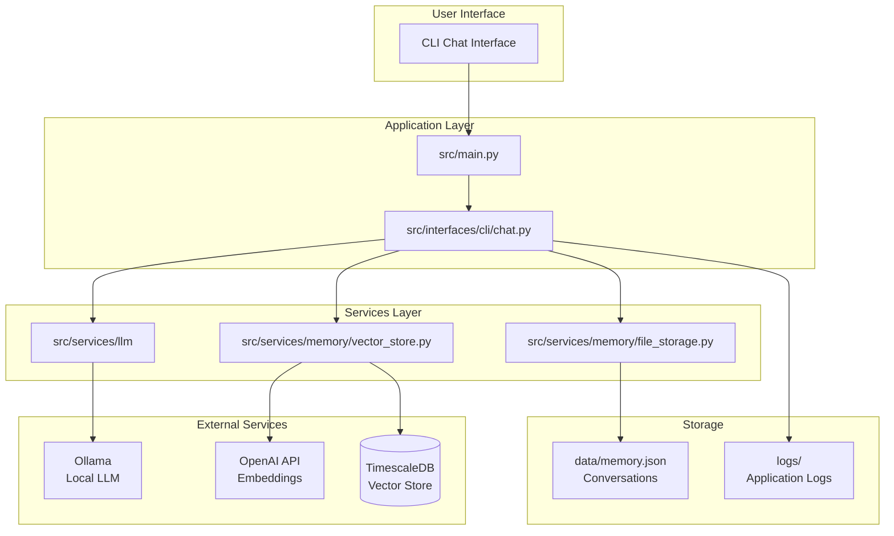
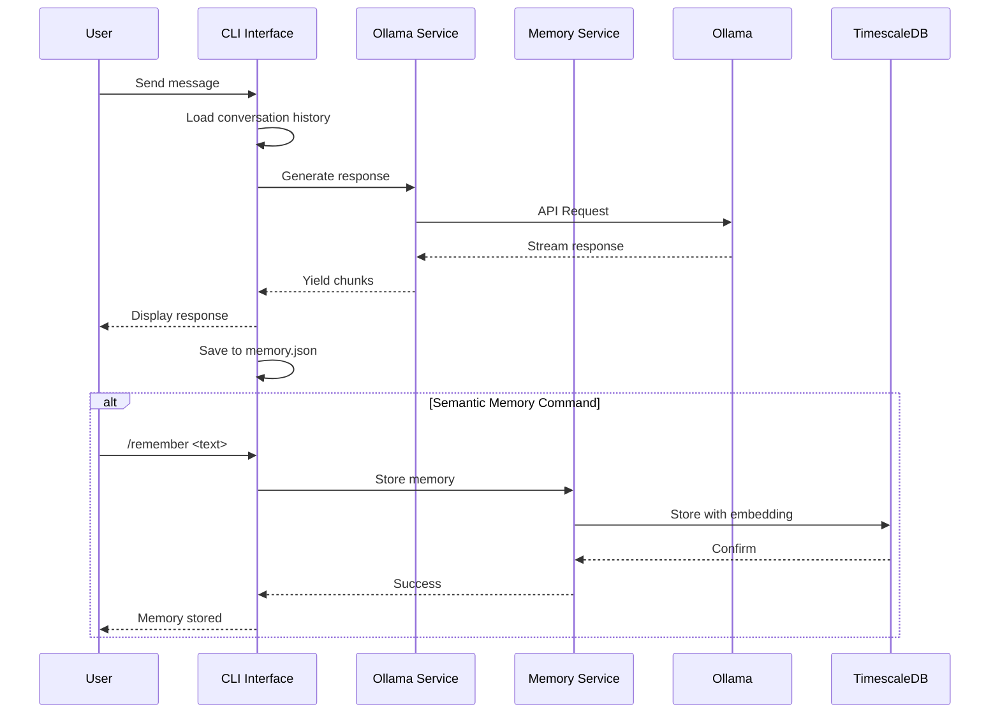
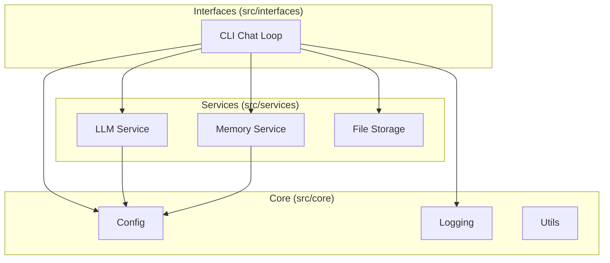
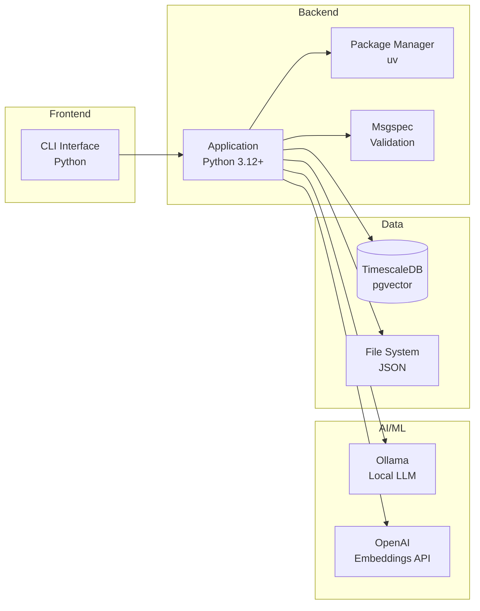

# Architecture Overview

Hermes Agent architecture and data flow diagrams.

## System Architecture

```mermaid
---
config:
  accessibility:
    - label: System Architecture
    - description: System architecture and data flow
---
graph TB
    subgraph "User Interface"
        CLI[CLI Chat Interface]
    end

    subgraph "Application Layer"
        Main[src/main.py]
        Chat[src/interfaces/cli/chat.py]
    end

    subgraph "Services Layer"
        OllamaService[src/services/llm]
        VectorStore[src/services/memory/vector_store.py]
        FileStore[src/services/memory/file_storage.py]
    end

    subgraph "External Services"
        Ollama[Ollama<br/>Local LLM]
        OpenAI[OpenAI API<br/>Embeddings]
        TimescaleDB[(TimescaleDB<br/>Vector Store)]
    end

    subgraph "Storage"
        JSON[data/memory.json<br/>Conversations]
        Logs[logs/<br/>Application Logs]
    end

    CLI --> Main
    Main --> Chat
    Chat --> OllamaService
    Chat --> VectorStore
    Chat --> FileStore
    OllamaService --> Ollama
    FileStore --> JSON
    Chat --> Logs
    VectorStore --> OpenAI
    VectorStore --> TimescaleDB
```

## Data Flow

```mermaid
---
config:
  accessibility:
    - label: Data Flow
    - description: Sequence diagram showing message flow
---
sequenceDiagram
    participant User
    participant Chat as CLI Interface
    participant OllamaSvc as Ollama Service
    participant MemorySvc as Memory Service
    participant Ollama
    participant TimescaleDB

    User->>Chat: Send message
    Chat->>Chat: Load conversation history
    Chat->>OllamaSvc: Generate response
    OllamaSvc->>Ollama: API Request
    Ollama-->>OllamaSvc: Stream response
    OllamaSvc-->>Chat: Yield chunks
    Chat-->>User: Display response
    Chat->>Chat: Save to memory.json

    alt Semantic Memory Command
        User->>Chat: /remember <text>
        Chat->>MemorySvc: Store memory
        MemorySvc->>TimescaleDB: Store with embedding
        TimescaleDB-->>MemorySvc: Confirm
        MemorySvc-->>Chat: Success
        Chat-->>User: Memory stored
    end
```

## Component Responsibilities

```mermaid
---
config:
  accessibility:
    - label: Component Responsibilities
    - description: Diagram describing component responsibilities across modules
---
graph TD
    subgraph "Core (src/core)"
        Core1[Config]
        Core2[Logging]
        Core3[Utils]
    end

    subgraph "Services (src/services)"
        Serv1[LLM Service]
        Serv2[Memory Service]
        Serv3[File Storage]
    end

    subgraph "Interfaces (src/interfaces)"
        CLI[CLI Chat Loop]
    end

    CLI --> Core1
    CLI --> Core2
    CLI --> Serv1
    CLI --> Serv2
    CLI --> Serv3
    Serv1 --> Core1
    Serv2 --> Core1
```

## Technology Stack

```mermaid
---
config:
  accessibility:
    - label: Technology Stack
    - description: Tech stack components and their relationships
---
graph LR
    subgraph "Frontend"
        CLI[CLI Interface<br/>Python]
    end

    subgraph "Backend"
        App[Application<br/>Python 3.12+]
        UV[Package Manager<br/>uv]
        Msgspec[Msgspec<br/>Validation]
    end

    subgraph "AI/ML"
        OL[Ollama<br/>Local LLM]
        OAI[OpenAI<br/>Embeddings API]
    end

    subgraph "Data"
        TS[(TimescaleDB<br/>pgvector)]
        FS[File System<br/>JSON]
    end

    CLI --> App
    App --> UV
    App --> Msgspec
    App --> OL
    App --> OAI
    App --> TS
    App --> FS
```
